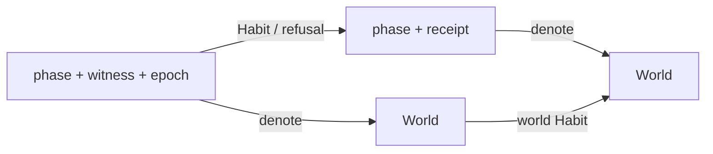

# QUANTUM NATIVE OBJECT — one schema, not one fiction

*Implementation spike on `experiment/q-sota-adapter`, 2026-08-25. The Lean
source is `Core/NativeObject.lean` plus `Core/QuantumObject.lean`.*

## Verdict

**Use one CIRIS object schema at every tier: yes. Use one materialized density
matrix, one solver chart, or one transported certificate at every tier: no.**

Newton is fully representable **as the simulator actually executes it**. Every
accepted finite machine step is an exact classical channel inside the quantum
object. This includes non-injective contact, damage, sleep, and rounding steps.
The claim is exact about the discrete implementation, not about the continuum
ODE and not a derivation of macroscopic mechanics from a microscopic quantum
Hamiltonian.

The current static-curvature evaluator is compatible for the same reason. Its
fixed metric is chart/control data consumed by an RK4 step. Dynamical geometry,
self-gravity, and quantum gravity are not supplied by this construction and
must remain typed refusals.

## Squint: the object is one square

Strip away the names and the object is a **partial Mealy machine presenting a
semantic endomorphism**, certified by a commuting square:

For every accepted top step, the two routes to the lower-right corner must be
equal. Admissibility, receipt validity, and epoch freshness are the other three
certification fields. Quantum mechanics changes the choice of `World` and the
allowed lower arrow; it does not change this square.

This is the DRY boundary:

- `Core.NativeObject` owns phases, receipts, refusals, the commuting law, Habit
  conveyance, and Q10's fence/Door/motion separation.
- `Core.QuantumObject` owns density operators, Kraus channels, and the
  classical-to-quantum embedding.
- A certified classical object is lifted by `liftObject`; the theorem
  `certified_liftObject` reuses all four certification gates.

## The exact Newton embedding

Let `X` be the finite set of machine states and let `T : X → Y` be one
deterministic solver step. Floating-point state is finite when regarded as bit
patterns. Define one Kraus operator per input state,

\[
K_x = |T(x)\rangle\langle x|.
\]

Then

\[
\sum_x K_x^\dagger K_x = I,
\qquad
\Phi_T(\rho)
  = \sum_x K_x\rho K_x^\dagger
  = \sum_x \rho_{xx}|T(x)\rangle\langle T(x)|.
\]

Thus `Φ_T` is a trace-preserving measure-and-prepare channel. On a diagonal
classical state `diag(p)`, it is exactly

\[
\Phi_T(\operatorname{diag}p)
  = \operatorname{diag}(T_*p).
\]

Many-to-one `T` is allowed: probabilities of preimages add. That is precisely
what is needed for damage, sleep, thresholding, collision merge sites, and
rounding. A stochastic step uses the same construction with a Markov kernel.
Alternatively, an explicit RNG state can be included in `X`, making the
executed transition deterministic again.

The Lean spike proves density preservation by construction, exact diagonal
realization, composition of lifted steps, and certification of a lifted CIRIS
object. The remaining formal rung is to construct the `K_x` family inside
`KrausChannel` and prove the displayed Kraus equality, rather than citing it in
the design note.

At runtime the density matrix must **not** be allocated. Store `T`, its chart,
and its receipt machinery symbolically. The density operator is the semantics;
the existing Newton kernel is the efficient representation.

## One World across eight tiers

The honest universal carrier is a disjoint union, not a forced common chart:

\[
\mathcal H = \bigoplus_{t\in\mathrm{Tier}} \mathcal H_t,
\qquad
\rho\in\mathsf{Density}(\mathcal H).
\]

`TieredDensity` encodes the finite-basis version as
`Density (Σ tier, State tier)`. Ordinary evolution is block-preserving.
Cross-block motion is a re-root candidate and does not inherit a certificate
merely because both blocks inhabit one sum type.

| Tier | Native lower arrow | Status in the one-object design |
|---|---|---|
| Gauge | exact quantum-link evolution / finite Kraus or unitary channel | Direct quantum instance |
| Crystal | none validated | Typed `NoValidatedEvaluator` refusal remains |
| Grain | cohesive deterministic machine step lifted diagonally | Exact executed semantics |
| Sandbox | granular/contact machine step lifted diagonally | Exact executed semantics |
| Landscape | cohesive deterministic machine step lifted diagonally | Exact executed semantics |
| Planet | fixed weak-field-chart geodesic RK4 lifted diagonally | Compatible inside the certified chart |
| Galactic | fixed central weak-field-chart geodesic RK4 lifted diagonally | Compatible inside the weak-field screen |
| Cosmic | static patch geodesic RK4 when screened | Compatible per patch; expansion-scale query refuses |

This unifies the object **type and certification grammar**. It does not claim
that the eight effective theories are one Hamiltonian, or that R1 claim
transport across a physical re-root has been solved.

## Curvature boundary

For a fixed declared geometry `g`, the current evaluator supplies a finite map

\[
T_{g,\Delta\tau}:\mathrm{WorldlineBits}\to\mathrm{WorldlineBits}.
\]

Its quantum-native semantics is simply `Φ_(T_g)`. The phase receipt must bind at
least the chart/metric identity, weak-field certificate, epoch, step size, and
local residual. This is exactly mesh gate M-G14: the metric witness travels with
the values.

Three different claims must remain separate:

| Claim | Verdict |
|---|---|
| Fixed external static curvature | Supported by the diagonal lift |
| Classical metric updated from matter/backreaction | Not implemented; requires a geometry-changing World Habit and locality warrant |
| Quantized geometry / quantum gravity | Not implied and not implemented |

The balance gate also remains chart-relative. A static chart has a conserved
Killing energy, but the current sandbox ledger does not compute it. An
expansion-dominated chart lacks the time-translation symmetry required for that
balance. Wrapping either case in a density operator cannot change those facts.

## What is and is not novel

The mathematical ingredients are established:

- Koopman's Hilbert-space representation of classical Hamiltonian evolution
  dates to 1931: [Koopman, *Hamiltonian Systems and Transformation in Hilbert
  Space*](https://pmc.ncbi.nlm.nih.gov/articles/PMC1076052/).
- Measure-and-prepare maps and their entanglement-breaking channel
  characterization are standard: [Horodecki, Shor, and Ruskai,
  *Entanglement Breaking Channels*](https://arxiv.org/abs/quant-ph/0302031).
- Geometry-indexed quantum theories and covariance across spacetime charts
  have a mature algebraic formulation: [Brunetti, Fredenhagen, and Verch,
  *The generally covariant locality principle*](https://arxiv.org/abs/math-ph/0112041).

Therefore **the underlying object and the classical channel lift are not novel
mathematics**. The defensible candidate novelty is narrower: the CIRIS
engineering synthesis of

1. direct quantum and diagonal classical kernels behind one object interface,
2. chart/metric/epoch witnesses conveyed phase by phase,
3. typed refusal across unlicensed curvature and re-root boundaries, and
4. a Q10 certificate whose fence, theorem-pinned anchors, and motion ledger are
   prevented by type and non-factoring obligations from becoming an error bar.

That may be a novel simulator architecture or formal specification, but it
should not be advertised as a literature-level novelty claim until a dedicated
prior-art search compares complete systems rather than individual ingredients.

## Next gates

1. Prove the `K_x = |T(x)><x|` construction is a `KrausChannel` in Lean.
2. Add a Rust symbolic `ClassicalLift<T>` adapter and check bit-identical output
   against the existing Newton/contact/cohesive/geodesic kernels.
3. Put the chart hash, weak-field witness, epoch, plan identity, and residual in
   the runtime phase receipt; plant wrong-metric and stale-epoch mutants.
4. Keep multi-tier execution refused until the R1 re-root ledger/claim transport
   gate lands.
5. Run Q10 only after the repaired Q8 admissible-manifold prerequisite is
   satisfied, preserving its three independently warranted readings.
