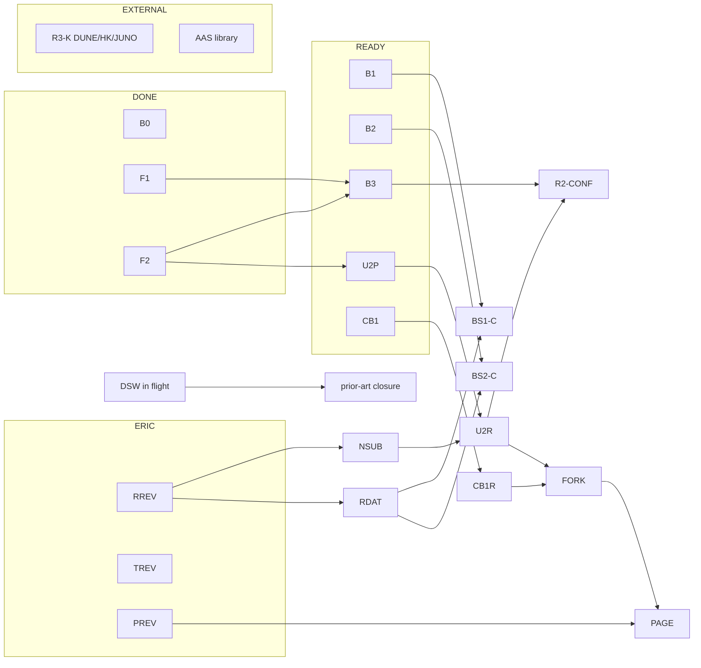

# MECHANIZATION ROADMAP — the distance to full physics confrontation (sealed 2026-08-22)

Question (steward): how far from a mechanization we can fully confront physics with?
Answer: **the distance is a dependency graph, not a duration** — two ledger rows
already ride proved theorems today, three bricks have no unmet dependencies, and the
GANTT below carries the full structure. The boundary between what becomes
theorem-vs-PDG and what stays simulation-vs-experiment is drawn explicitly.

## Debts paid this pass
- Mathlib API risk RETIRED: `exp_transpose`, `exp_conjTranspose`, `exp_units_conj`
  all present in the pinned Mathlib (Analysis/Normed/Algebra/MatrixExponential.lean).
- R2's computable check RUN — with two findings (below).
- Under-searched sweep debts (institution theory; sociophysics discrete types)
  dispatched to a dedicated agent (in flight).
- AAS 1981 original: pre-DOI, remains cited-via-secondary, flagged (library debt).

## Finding 1 (from the feasibility check): the tier-cascade estimator is
STRUCTURALLY BLIND to depth suppression on K11. With 4–5 kinds per stratum, the top
tiers flood with within-stratum channels; tier ratios move only 0.98→0.94 as ε drops
1.0→0.1. CKM shows its hierarchy because flavor has ONE state per stratum — every
channel is cross-depth. This sharpens the retro-explanation of our flat cascade (it
was structural, not merely sampling) and redirects the enhancement's estimator: the
depth mechanism must be read from CHANNEL MASS BY DEPTH-DISTANCE CLASS, which the
toy shows identifies ε cleanly (step ratios ≈ ε at every ε).

## Finding 2 (EXPLORATORY — sealed data, post-hoc estimator, depth assignment taken
from Surface/Stack.lean: surfaces 0; assertive stack Facts0–Confidence1–Model2–
Premises3; twin pairs at 1): the corpus INVERTS the flavor sign. Mean channel mass
RISES with |Δdepth|: CUR-P2 0.0046/0.0291/0.0290/0.0645 (steps 6.3×, 1.0×, 2.2×);
CUR-SP replicates (4.0×, 0.6×, 3.2×). Confusion flows along the GROUNDING VERTICALS
— the predicted boundary trio are all cross-depth within-block lines — not laterally
within strata. Reading (wager): epistemic mixing is grounding-adjacent (a claim and
its ground are what a reader can confuse), ε>1; ontic mixing is charge-suppressed,
ε<1; the depth-blind point ε=1 separates the regimes. This composes with the A2A
result (our object lives in the observer sector). CONFIRMATORY version: stake
cross/same-depth mass ratio > 1 on unseen substrates in UNIV-2. NOT cashed here.

## CONFRONT-CORE — the bricks
- **Brick 0 (standing, proved).** FlavorBridge (share = ln2−H₂((1+J)/2) — R1 rides
  it at measured J), Symmetry (the twins' four-of-forty-million), the caps, valve,
  mint, NonFactoring. Already confrontation-grade.
- **Brick 1.** The REG+ lattice defined in Lean: state space, sector-unitary
  collisions; theorem: collisions preserve (N,P); the 53 sectors by `decide`.
  Upgrades BS-1's REG side to theorem.
- **Brick 2.** The route symmetries as two-line matrix identities:
  H(−φ)=H(φ)ᵀ ⇒ exp-transpose ⇒ return-evenness p_ii(−φ)=p_ii(φ); the 1↔2
  permutation conjugation ⇒ chirality pairing p01(−φ)=p02(φ); candidate π-period
  via the gauge+relabel identity. Upgrades Leg C2's machine-exact numerics to
  proofs (evidential bin unchanged — still QM — but the REG side becomes theorem).
- **Brick 3.** The depth-charge extension, BOTH regimes (ε<1
  hierarchical / ε>1 grounding-adjacent), with three theorems: (a) ε→1 recovers
  REG v0.3 (flat limit); (b) the tier-cascade estimator's blindness (Finding 1 as
  a theorem); (c) the depth-class estimator identifies ε (expectation ε^k·c̄).
  Confrontation: flavor fits ε≈0.2 with one state per stratum; the corpus reads
  ε>1 (exploratory, to be staked). One parameter, two regimes, opposite signs —
  the sharpest delta the programme now owns.
- **Out of scope, stated honestly.** The sin²Φ transport magnitude and the
  hydrodynamic limit stay numerical (decades-hard analysis; the field's own open
  edge). Confrontation there remains simulation-vs-experiment with the dephasing
  control as the non-gauge comparator (Sornette gate discharged at that level).

## What "fully confront" then means, concretely
Theorem-vs-measurement rows after the bricks: R1 (bridge share at PDG J — already),
R3 (maximal-CP structure — already), BS-1 (conservation — Brick 1), R4/BS-2 (route
symmetries — Brick 2), R2 (depth mechanism, both regimes — Brick 3).
Simulation-vs-experiment rows: transport magnitudes, hydrodynamic limits.
If it is real, this is the shape "pretty much there" takes: the core claims become
machine-checked predictions confronting published numbers, with the two honest
exceptions named and fenced.

## THE GANTT — pure dependency structure (no durations)

| id | task | depends on | unlocks |
|---|---|---|---|
| B0 | standing proved core (bridge, twins, caps, valve, mint) | — DONE | R1, R3 (live now) |
| F1 | tier-estimator blindness finding | — DONE | B3 |
| F2 | depth-inversion exploratory (ε>1) | — DONE | B3, U2P |
| B1 | lattice + (N,P) conservation in Lean | — **DONE** (Core/Lattice.lean, green 2026-08-23) | BS1-C |
| B2 | route symmetries in Lean (evenness, chirality) | — **DONE** (Core/RouteSymmetry.lean, green 2026-08-23) | BS2-C |
| B3 | depth-charge extension | core **DONE** (Core/DepthCharge.lean, green 2026-08-23: class cards, blindness counting fact, identification, flat limit); stochastic-κ + ε>1 many-body remain with the sim session | R2-CONF |
| U2P | UNIV-2 prereg | — **FROZEN** (UNIV2_PREREG.md, 2026-08-23) | U2R |
| CB1 | CBD-1 design | — **FROZEN** (CBD1_DESIGN.md, 2026-08-23) | CB1R |
| DSW | under-searched sweep debts | — IN FLIGHT (agent) | prior-art closure |
| NSUB | new unseen substrate (human labels OR agent stream) | RREV | U2R, ATLAS |
| RDAT | corpus route statistics (loops/chains) | RREV (shadow) OR wild-chain corpus | BS1-C, BS2-C |
| U2R | UNIV-2 run | U2P, NSUB | FORK |
| CB1R | CBD-1 run | CB1 | FORK |
| BS1-C | conservation corpus confrontation | B1, RDAT | P1 |
| BS2-C | even-harmonic route confrontation | B2, RDAT | P3+P5 |
| R2-CONF | depth-mechanism confrontation (flavor ε≈0.2 vs corpus ε>1) | B3, U2R | P2 sharpened |
| FORK | law-vs-ecology resolution | U2R, CB1R | PAGE |
| RREV | RATCHET #24/#25 review | ERIC | NSUB, RDAT |
| TREV | treatise review + placement | ERIC | publication |
| PREV | steward page review | ERIC | PAGE |
| PAGE | page update | PREV, FORK | — |
| R3-K | maximal-CP lepton kill | EXTERNAL (DUNE/HK/JUNO) | R3 resolution |
| AAS | AAS 1981 primary citation | EXTERNAL (library) | citation closure |

Critical path to the fork: RREV → NSUB → U2R → FORK (everything else on that path
is ready or in flight). Critical path to full theorem-grade confrontation: B1+B2+B3
(no unmet deps) + RDAT (gated on RREV or a wild-chain corpus).
